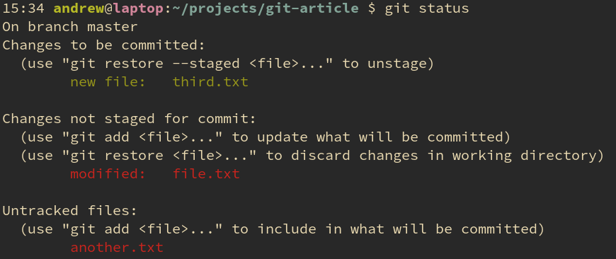
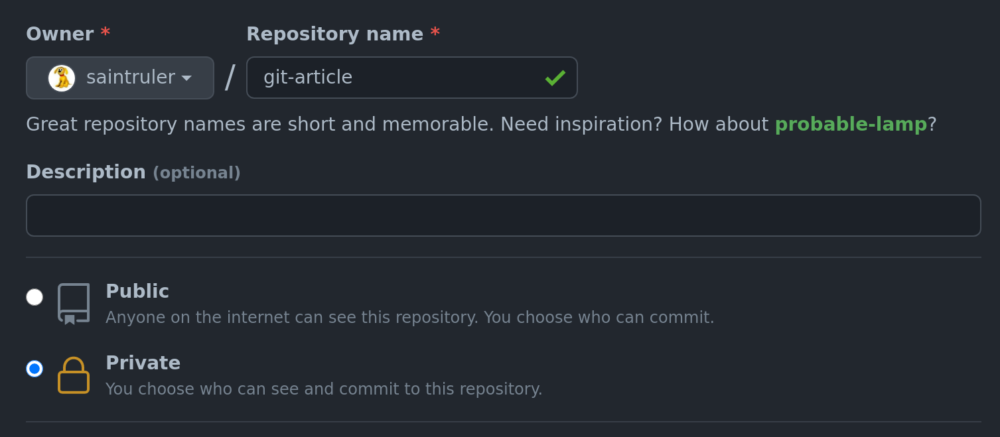
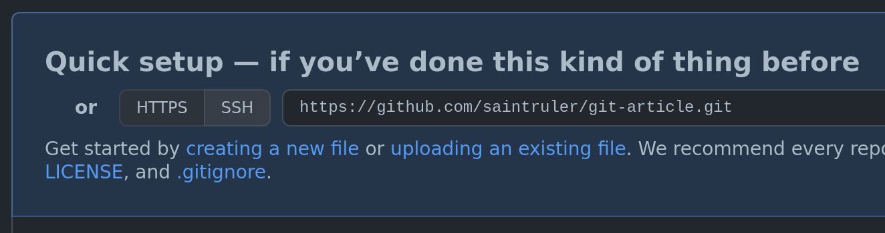

# Git
{: .no_toc }

## Содержание
{: .no_toc .text-delta }

1. TOC
{:toc}

## Зачем?

Никто не думает, что **ему** нужна программа для контроля версий своего проекта
ровно до тех пор, пока не станет слишком поздно.

А ещё никто не любит терять важные документы, либо часы своего драгоценного
времени из-за сломанной флешки или отключенного света. А ещё обиднее ситуация,
когда ты написал крайне заумную фичу, полюбовался ею и пошёл писать следующую.
Но случился казус --- новая фича сломала программу, `Ctrl+Z` уже не может
вернуть к предыдущей рабочей версии, а сам ты не можешь вспомнить как
восстановить прошлое состояние проекта...

Первым решением будет создавать копию папки проекта с каждым таким удачным
состоянием. Но тогда таких копий может стать очень много. А если периодически
чистить такие копии, то может потеряться **та самая** версия проекта, которая
нужна была ещё вчера.

Но самая большая проблема возникает тогда, когда над проектом работает больше
**одного** человека. Облачные системы синхронизации типа `GDrive`, `YaDisk`,
`Dropbox` не сильны в решении конфликтов при синхронизации и только создадут
головную боль. Как объединять две версии проекта с таким подходом я даже не хочу
себе представлять...

На решение всех этих проблем приходят системы контроля версий: `Git` и
`Mercurial`. У обеих систем есть свои приложения, но здесь рассмотрим только
*Git*, так как он является намного более популярным и имеет множество развитых
проектов, предоставляющих возможность бесплатного хранения проектов.

## Установка

### Linux

Установить *git* можно с помощью пакетного менеджера твоей системы: например,
`sudo apt install git`.

[//]: # (Не уверен, что можно предполагать стандартность установки ubuntu)

### MacOS

На *MacOS* установить *git* можно с помощью пакетного менеджера *Homebrew*. Если
ты ещё не установил *brew*, можешь сделать это с помощью команды в терминале:

```bash
  /bin/bash -c "$(curl -fsSL https://raw.githubusercontent.com/Homebrew/install/HEAD/install.sh)" 
```

После этого установить *git* можно командой `brew install git`.

### Windows

Программу для установки можно скачать [здесь](https://git-scm.com/download).
Изменять какие-то параметры установки не обязательно, поэтому для простой и
стандартной установки достаточно просто нажимать на `Next`.

[//]: # (TODO: Сделать уточнения по поводу нескольких этапов установки)

## Базовые команды

Для того, чтобы начать пользоваться гитом достаточно всего нескольких команд и
некоторого понимания основных понятий.

### Репозиторий

*Репозиторий* --- это хранилище всех зафиксированных версий всех отслеживаемых
объектов в папке проекта.

### Коммит

*Коммит* --- совокупность изменений файлов, отслеживаемых репозиторием,
относительно предыдущего коммита. С одной стороны, так как коммиты фиксируют
только изменения, то размер репозитория значительно уменьшается, чем если бы
файлы хранились целиком. С другой стороны, остаётся возможность отката к любой
зафиксированной версии репозитория.

### Состояния файлов

В любом репозитории файлы находятся в четырёх состояниях:

- *Untracked* (не отслеживаемые) --- файлы, которые находятся в папке
  репозитория, но их изменения никак не влияют на само состояние репозитория;
- *Unstaged* --- сам файл отслеживается гитом, но изменения относительно
  предыдущего коммита не будут зафиксированы;
- *Staged* --- означает, что файл и отслеживается гитом, и изменения будут
  зафиксированы;
- *Commited* --- в файле нет изменений относительно предыдущего коммита.

### Необходимые команды

Для создания репозитория достаточно ввести `git init` в папке с проектом. После
этого все файлы в этой папке будут считаться *Untracked*.

С помощью команды `git add [files]` можно перевести файлы из состояния
*Untracked* или *Unstaged* в состояние *Staged*. Если отслеживаемый файл после
выполнения этой команды файл был изменён, то необходимо снова его добавить в
Stage.

Перед фиксированием изменений полезно проверить состояние репозитория. Команда
`git status` выведет список состояний файлов в текущей папке.



Таким образом можно проверить все ли изменения будут зафиксированы.

Само фиксирование изменений происходит с помощью команды `git commit`. Для
коммита с простым описанием достаточно команды `git commit -m "<message>"`. Одна
строка `<message>` будет добавлена к коммиту и записана в хранилище. Обычно,
простого описания будет достаточно. Но если необходимо более развёрнутое и
многострочное описание, то можно выполнить команду `git commit` без аргументов.
Будет вызван текстовый редактор (если не настраивать иначе, то скорее всего
будет вызван *Vim*).

## Распространение репозитория на другие компьютеры

С помощью команд из предыдущего пункта можно вести простую прямую историю
репозитория на одном компьютере. Но репозиторий, лежащий на одном компьютере не
очень полезен, поэтому его нужно понять как его распространить.

### Github

Для хранения репозиториев зачастую используются сервисы типа
[GitHub](https://github.com/). Несмотря на то, что технически *git* --- это
распределённая и децентрализованная система контроля версий, удобно принять один
из репозиториев за центральный и синхронизировать свой репозиторий с ним.

Далее будет подразумеваться, что для хранения репозиториев используется
*GitHub*, поэтому будет полезно на нём зарегистрироваться.

Для создания нового репозитория нужно на главной странице сервиса нажать на
зелёную кнопку `New`, чтобы открылась следующая страница:



После нажатия на кнопку `Create repository` будет открыта страница с новым
репозиторием в которой сразу же предложат скопировать на него ссылку:



Так и поступим.

### Внешние репозитории

Так как данный репозиторий хранится на серверах *GitHub*, нужно добавить ссылку
на него в локальный репозиторий. Делается это со помощью команды `git remote`.
Так как внешних репозиториев может быть несколько, каждому из них нужно
присвоить какое-то имя. Обычно основной внешний репозиторий называют `origin`.
Таким образом, вся команда для добавления внешнего репозитория:

```sh
  git remote add <remote-url>
```

Для моего только что созданного репозитория `<remote-url>` равна
`https://github.com/saintruler/git-article.git`.

После этого для синхронизации с этим репозиторием можно написать `git push -u
origin master`. В этой команде мы указываем, что ветка `master` должна быть
отправлена на внешний репозиторий `origin`. После выполнения этой команды один
раз эта связь будет записана в репозитории и для синхронизации ветки `master`
будет достаточно написать просто `git push`.

Если внешний репозиторий был обновлён с другого компьютера, то для синхронизации
текущего компьютера нужна команда `git pull`.

### Клонирование репозиториев

Но для изменения репозитория с другого компьютера нужно чтобы этот репозиторий
появился на другом компьютере. Для этого используется команда `git clone`. Хотя
и можно скопировать репозиторий на флешку или запаковать и передать в
мессенджере или облаке, клонирование является основным и самым богоугодным
способом перенести свой репозиторий на другой компьютер.

При клонировании репозитория ссылка на клонируемый репозиторий сама добавляется
как внешний репозиторий `origin`.

## Github Flow

- https://guides.github.com/introduction/flow/
- https://githubflow.github.io/

---

> Автор: [Андрей Гущин](../authors/andrew_guschin.md)
