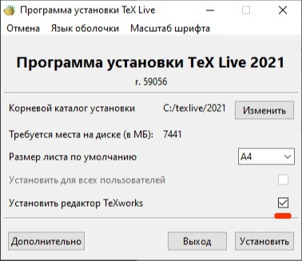
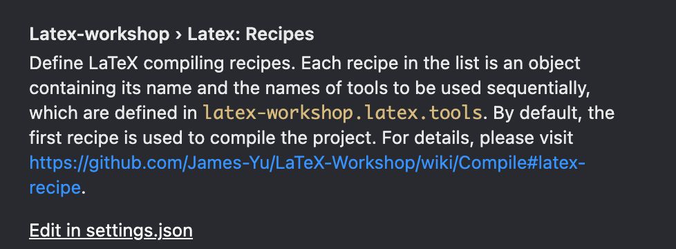
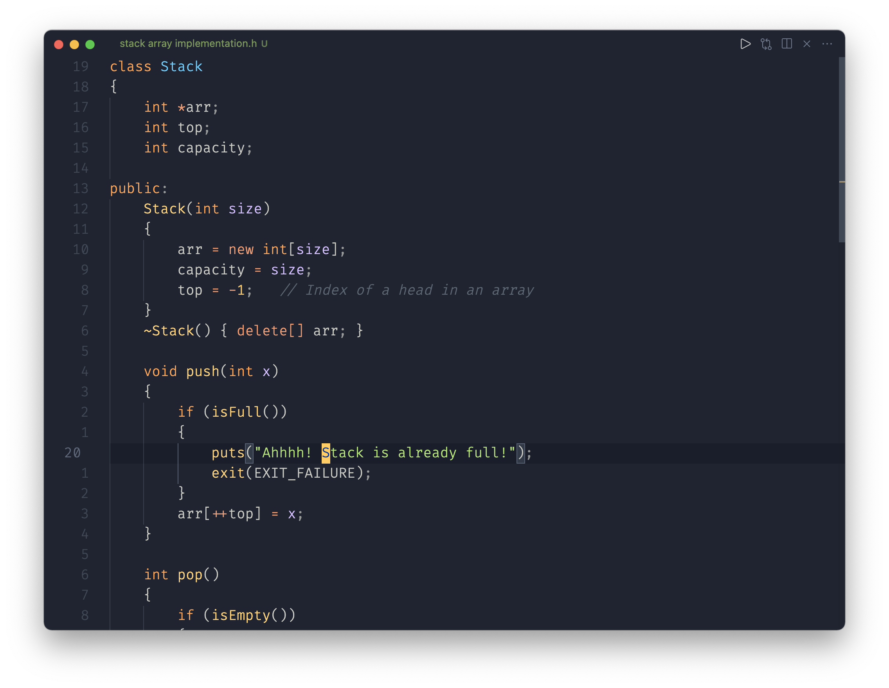
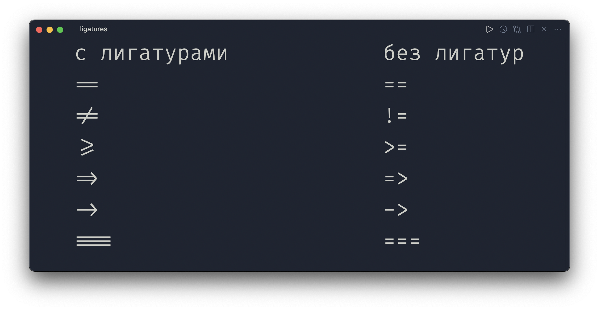

# Visual Studio Code

- [Что такое Visual Studio Code?](#что-такое-visual-studio-code)
- [Где скачать](#где-скачать)
- [Настройка для работы с C++](#настройка-для-работы-с-c)
  - [Windows](#windows)
  - [Linux](#linux)
  - [Mac](#mac)
- [Несколько советов для удобства](#несколько-советов-для-удобства)
- [Работа с Git](#работа-с-git)
  - [VS Code в браузере](#vs-code-в-браузере)
- [Кастомизация](#кастомизация)
  - [Темы](#темы)
  - [Иконки файлов](#иконки-файлов)
  - [Шрифт](#шрифт)
  - [Скрытие панелей](#скрытие-панелей)
  - [Настройки](#настройки)

## Что такое Visual Studio Code?

*Visual Studio Code* — это текстовый редактор, вроде блокнота в *Windows*,
но созданный специально для программистов: он поставляется вместе с подсветкой
синтаксиса, автодополнением, встроенным терминалом, системой контроля версий и
ещё огромным количеством инструментов, упрощающих написание кода. Однако
*VS Code* это не *IDE*, т.е. он изначально не содержит в себе инструментов для
компиляции и запуска написанного кода, что означает, что для комфортной
разработки, его необходимо настроить соответствующим образом. Именно этому и
посвящена данная статья.

## Где скачать

Загрузить *VS Code* можно
<a href="https://code.visualstudio.com/" target="_blank">здесь</a>. Сайт сам
поймёт, какую операционную систему ты используешь, и предложит соответствующую
версию. При установке рекомендуем поставить все галочки и не менять язык на
русский, так как вся статья написана для англоязычной версии.

## Настройка для работы с C++

### Windows

1. Установить компилятор `g++`
[отсюда](http://www.equation.com/servlet/equation.cmd?fa=fortran), выбрав
последнюю доступную версию нужной разрядности. После установки необходимо
перезапустить компьютер;
2. Открываем командную строку, для этого нажимаем комбинацию клавиш `Win + R`,
вводим `cmd` и нажимаем *Enter*, в открывшемся окне прописываем `g++ --version`
и снова нажимаем *Enter*. Если ты увидишь сообщение, содержащее версию, значит
компилятор установлен и можно переходить к следующему шагу. Если же появится
ошибка, значит система не понимает, где установлен компилятор, и ей необходимо
указать, где он находится. Для этого необходимо добавить `g++` в `PATH`:
*Параметры > Система > О системе > Сведения о системе > Дополнительные параметры
системы > Переменные среды > Системные переменные > Path*, тут необходимо
нажать кнопку *Добавить* и вставить следующий путь:
`c:\mingw\libexec\gcc\x86_64-w64-mingw32`;
3. Теперь ты можешь компилировать *С++* код, прописывая в консоли
`g++ FILE_NAME.cpp`, и запускать скомпилированный файл `a.exe`. Однако можно
автоматизировать этот процесс внутри *VS Code*. Для этого нужно зайти в раздел с
расширениями с помощью комбинации клавиш `Ctrl + Shift + X` или можно нажать на
иконку с кубиками в боковой панели, а затем найти и установить расширение
`Code Runner`;
4. Теперь, чтобы скомпилировать `.cpp` файл, можно просто использовать
комбинацию клавиш `Ctrl + Alt + N` или соответствующую кнопку в правом верхнем
углу. При желании, её можно изменить в настройках;
5. Далее необходимо открыть настройки, пользуясь сочетанием клавиш `Ctrl + ,`
или нажав на шестерёнку в левом нижнем углу. В строке поиска ввести
`@ext:formulahendry.code-runner terminal` и поставить галочку в
`Code-runner: Run In Terminal`. Теперь код будет запускаться во встроенном
терминале, и у тебя появится возможность вводить входные данные с клавиатуры.

### Linux

1. Установить компилятор `g++` используя пакетный менеджер, например, если ты
используешь *Ubuntu*, тебе нужно открыть терминал и написать
`sudo apt install gcc`;
2. Чтобы убедиться, что компилятор установился правильно, введи в терминале
`g++ --version`. Если всё в порядке, ты увидишь сообщение, содержащее версию
`g++`;
3. Далее, уже в самом *VS Code*, заходим в раздел с расширениями с помощью
`Ctrl + Shift + X` или можно просто нажать на иконку с кубиками в боковой
панели, а затем найти и установить расширение `Code Runner`;
4. Теперь, чтобы скомпилировать `.cpp` файл, ты можешь просто использовать
комбинацию клавиш `Ctrl + Alt + N`. При желании, её можно изменить в настройках;
5. Далее необходимо открыть настройки, пользуясь сочетанием клавиш `Ctrl + ,`
или нажав на шестерёнку в левом нижнем углу. В строке поиска ввести
`@ext:formulahendry.code-runner terminal` и поставить галочку в
`Code-runner: Run In Terminal`. Теперь код будет запускаться во встроенном
терминале, и у тебя появится возможность вводить входные данные с клавиатуры.

### Mac

1. На *Mac* установить компилятор `g++` легче всего, используя пакетный менеджер
*Homebrew*, который не установлен по умолчанию. Чтобы его установить, тебе нужно
открыть терминал и вставить туда следующую команду:
`/bin/bash -c "$(curl -fsSL
https://raw.githubusercontent.com/Homebrew/install/HEAD/install.sh)"`;
2. Теперь, чтобы установить компилятор, нужно просто написать в терминале
`brew install gcc`. После этого ты можешь проверить, что компилятор
действительно установился, для этого введите в терминале `g++ --version`. Если
`g++` установлен, ты увидишь сообщение, содержащее его версию;
3. Далее, уже в самом *VS Code*, заходим в раздел с расширениями с помощью
`Cmd + Shift + X` или можно просто нажать на иконку с кубиками в боковой панели,
а затем найти и установить расширение `Code Runner`;
4. Теперь, чтобы скомпилировать `.cpp` файл, можно просто использовать
комбинацию клавиш `Cmd + Alt + N`. При желании, её можно изменить в настройках;
5. Далее необходимо открыть настройки, пользуясь сочетанием клавиш `Cmd + ,` или
нажав на шестерёнку в левом нижнем углу. В строке поиска ввести
`@ext:formulahendry.code-runner terminal` и поставить галочку в
`Code-runner: Run In Terminal`. Теперь код будет запускаться во встроенном
терминале, и у тебя появится возможность вводить входные данные с клавиатуры.

## Несколько советов для удобства

1. Если ты раньше пользовался *Visual Studio*, и, открывая свой старый код, у
тебя возникают проблемы с отображением кириллицы, тебе следует изменить
кодировку файла. Для этого во встроенной командной строке найди
`Change File Encoding` > `Reopen with Encoding` и выбери самое первое с подписью
*Guessed from content*.
2. Для того, чтобы программа корректно компилировалась, каждый раз после её
изменения нужно сначала её сохранить с помощью `Ctrl + S`. Чтобы этого не
делать, можно включить автосохранение: для этого нужно найти параметр
`Files: Auto Save` в настройках и выбрать значение `afterDelay`.
3. Чтобы изменить или добавить сочетания клавиш, открой командную строку
(`Ctrl + Shift + P` на *Windows* и *Linux* или `Cmd + Shift + P` на *Mac*) и в
поиске найди `Preferences: Open Keyboard Shortcuts`. Например, одной из полезных
горячих клавиш будет увеличение/уменьшение размера шрифта, для этого в меню
горячих клавиш введи `Editor Font Zoom` и поставь горячие клавиши на `...In` и
`...Out`, мы предпочитаем использовать `Ctrl + =` для увеличения и `Ctrl + -`
для уменьшения шрифта.
4. При компиляции `.cpp` файла в папке с ним появляется `.out` файл. Чтобы
`.out` файлы не мешались во встроенном проводнике, можно скрыть их в настройках.
Для этого в настройках введи `Files: Exclude`, и добавь туда значение `*.exe`
(аналогично для любого другого расширения).

## Настройка для работы с LaTeX

Настройка состоит из двух частей: установка самого пакета *LaTeX* и настройка
*Visual Studio Code* для работы с ним.

### Настройка на Windows

1. Для начала необходимо загрузить актуальную версию одного
из нескольких дистрибутивов *LaTeX*. Основные из них это
<a href="http://www.tug.org/texlive/acquire-netinstall.html" target="_blank">*TeXLive*</a>
и
<a href="https://miktex.org/download" target="_blank">*MikTeX*</a>.
Далее будем считать, что был выбран *TeXLive*, однако, в целом, процесс установки
аналогичен.

2. Далее необходимо установить загруженный дистрибутив.
*TeXLive* устанавливается в пару кликов, поэтому проблем возникнуть не должно.
При необходимости можно поменять стандартное место установки, однако
автор не гарантирует работоспособность в таком случае (это Windows, в нем может быть всё, что угодно). В случае с *TeXLive* также имеет смысл
отказаться от установки TeXWorks, так
как пользоваться мы будем *Visual Studio Code*:

    

    P.S. Установка занимает значительное время, так что готовься к долгому и
    томительному ожиданию прекрасного 
.

3. Теперь установим плагин *LaTeX Workshop* для *Visual Studio Code*.
Для этого в меню необходимо открыть вкладку `Extensions`.
Получить доступ к ней можно в левой боковой панели или с помощью `Ctrl + Shift + X`.
Далее в поиске необходимо ввести "*LaTeX Workshops*", перейти на страницу плагина
и нажать `Install` в появившемся меню.

4. <a id="tex-win-anchor"></a>Всё необходимое для работы установлено. Теперь можно
   проверить, все ли было установлено корректно, открыв через *Visual Studio
   Code* предварительно созданную папку, создав в ней файл `main.tex` с
   следующим содержимым:

      ```tex
      \documentclass[12pt]{article}
      \begin{document}
      Hello world!
      $Hello world!$ %math mode 
      \end{document}
      ```

    После чего необходимо сохранить файл с помощью `Ctrl + S`.
    Если компиляция PDF-файла не началась автоматически, то необходимо открыть
    вкладку `LaTeX` в левой боковой панели. В меню `Build LaTeX Project`
    располагаются рецепты для сборки. От себя могу лишь порекомендовать
    использовать `latexmk`. В дальнейшем, PDF будет
    собираться повторно после каждого сохранения с помощью
    `Ctrl + S`.

    Если всё было установлено верно, то в папке помимо `main.tex` должны появится
    новые, временные файлы сборки.

    Теперь можно посмотреть полученный PDF-файл, открыв его в `Explorer`. Однако есть
    более приятный способ. Рядом с вкладкой `Build LaTeX Project` находится вкладка
    `View LaTeX PDF`. В ней есть множество способов открыть файл, самый удобный,
    на мой взгляд, `View in VSCode Tab`. Эта опция позволяет одновременно
    редактировать файл и наблюдать превью в другой части экрана, по умолчанию в
    правой.

5. Для полноценной работы необходима некоторая дополнительная настройка. Дело в
том, что некоторые пакеты в *LaTeX* (в каком-то смысле являющиеся аналогом
`#include` в С++) требуют дополнительного ПО для полноценной работы.
Установим его. Нам понадобится:

    1. Установить Python. Для этого переходим на <a href="https://www.python.org/downloads/release/python-396/https://www.python.org/downloads/release/python-396/" target="_blank">официальный сайт</a>, после чего загружаем
    версию, соответствующую нашей системе `Windows Installer (32/64-bit)`. Если
    не уверены в битности вашей системы — посмотреть ее можно в разделе "Свойства системы" *Windows*.

        ВАЖНО! При установке необходимо поставить галочку возле
        опции "Добавить путь к *Python* в переменную *PATH*".

        После установки желательно перезагрузить компьютер.
        Теперь, с помощью сочетания `Win + R` выполняем команду `cmd`, после
        чего попадаем в терминал *Windows*. Можно проверить, что *Python* был
        установлен корректно с помощью команды `python --version`. Если терминал выводит слово *Python* без версии, то ты попал в ловушку *Windows* (да, да, ещё один повод сменить операционную систему). Дело в том, что *Microsoft* по каким-то соображениям решила, что загружать *Python* следует из их магазина, а не с официального сайта. Поэтому при вводе `python` тебя должно перекинуть в *Windows Store* для его установки. Тем не менее, мы уже выполнили установку, причем с официального сайта языка. Поэтому, достаточно лишь отключить "подмену" исполняемого файла. Для этого необходимо попасть в раздел "Псевдонимы выполнения приложения". Сделать это удобнее всего, нажав сочетание клавиш `Win + S`, после чего введя в поиск название раздела. В нем необходимо сменить ползунок возле установщиков приложениий `python.exe` и `python3.exe`.
    2. Теперь установим пакет *pygmentize* с помощью команды `pip3 install pygments` в терминале (`Win + R` -> `cmd`).
    3. Далее переходим в `Extensions`, находим в списке `LaTeX Workshops`.
        Нажимаем на шестеренку, после чего выбираем `Extension Settings`. В
        строке поиска после уже написанного пишем `recipes`, тем самым находим
        необходимую настройку и жмем `Edit in settings.json`.
        
    4. Находим в файле `"latex-workshop.latex.tools"`. Ниже располагается список
        всех рецептов. В выбранный ранее вами рецепт (можно во все) нужно добавить
        флаг `-shell-escape`. Для `latexmk`, например, должно получиться
        следующее:

        ```json
        "name": "latexmk",
                    "args": [
                    "command": "latexmk",
                        "-synctex=1",
                        "-interaction=nonstopmode",
                        "-file-line-error",
                        "-pdf",
                        "-outdir=%OUTDIR%",
                        "%DOC%",
                        "-shell-escape",
                    ],
                    "env": {}
          ```

  5. Теперь можно проверить полноценную функциональность. Для оформления
      разного вида работ студентам ПИ и ФИИТ предоставлен шаблон
      *LaTeX*-проекта. Его можно загрузить на портале course.sgu.ru. Кроме
      того, загрузить этот шаблон можно 
      <a href="https://github.com/WrongWayboyyyy/textemplate" target="_blank">тут</a>.
      Осталось поместить содержимое в папку и собрать
      аналогичным образом, как в пункте [4](#tex-win-anchor).

### Настройка на Linux

1. Сперва загрузим и установим актуальную версию *TeXLive*. Удобнее
всего сделать это с помощью пакетного менеджера, очень многие
из них содержат *TeXLive*.
Кроме того, советую искать *full* версию, так как она содержит уже все необходимые пакеты. Для *Ubuntu*, например, достаточно
написать `sudo apt install texlive-full`.

    P.S. Установка занимает значительное время, так что готовься к долгому и томительному ожиданию прекрасного
    .

2. Теперь установим плагин *LaTeX Workshop* для *Visual Studio Code*.
Для этого в меню необходимо открыть вкладку `Extensions`.
Получить доступ к ней можно в левой боковой панели или с помощью `Ctrl + Shift + X`.
Далее в поиске необходимо ввести "*LaTeX Workshops*", перейти на страницу плагина
и нажать `Install` в появившемся меню.

3. <a id="tex-linux-anchor"></a>Всё необходимое для работы установлено. Теперь можно
   проверить, все ли было установлено корректно, открыв через *Visual Studio
   Code* предварительно созданную папку, создав в ней файл `main.tex` с
   следующим содержимым:

      ```tex
      \documentclass[12pt]{article}
      \begin{document}
      Hello world!
      $Hello world!$ %math mode 
      \end{document}
      ```

    После чего необходимо сохранить файл с помощью `Ctrl + S`.
    Если компиляция PDF-файла не началась автоматически, то необходимо открыть
    вкладку `LaTeX` в левой боковой панели. В меню `Build LaTeX Project`
    располагаются рецепты для сборки. От себя могу лишь порекомендовать
    использовать `latexmk`. В дальнейшем, PDF будет
    собираться повторно после каждого сохранения с помощью
    `Ctrl + S`.

    Если всё было установлено верно, то в папке помимо `main.tex` должны появится
    новые, временные файлы сборки.

    Теперь можно посмотреть полученный PDF-файл, открыв его в файловом менеджере или через терминал. Однако есть
    более приятный способ. Рядом с вкладкой `Build LaTeX Project` находится вкладка
    `View LaTeX PDF`. В ней есть множество способов открыть файл, самый удобный,
    на мой взгляд, `View in VSCode Tab`. Эта опция позволяет одновременно
    редактировать файл и наблюдать превью в другой части экрана, по умолчанию в
    правой.

  4. Для полноценной работы необходима некоторая дополнительная настройка. Дело в
   том, что некоторые пакеты в *LaTeX* (в каком-то смысле являющиеся аналогом
   `#include` в С++) требуют дополнительного ПО для полноценной работы.
   Установим его. Нам понадобится:

      1. Установить *Python* с помощью пакетного менеджера. В случае с Ubuntu, необходимо ввести `sudo apt install python`. Вместе с *Python* поставляется его пакетный менеджер *pip*, он и пригодится нам в следующем шаге.
      2. Затем установить пакет *pygmentize* с помощью `pip3 install pygments`.
      3. Далее переходим в `Extensions`, находим в списке `LaTeX Workshops`.
        Нажимаем на шестеренку, после чего выбираем `Extension Settings`. В
        строке поиска после уже написанного пишем `recipes`, тем самым находим
        необходимую настройку и жмем `Edit in settings.json`.
          
      4. Находим в файле `"latex-workshop.latex.tools"`. Ниже располагается список
        всех рецептов. В выбранный ранее вам рецепт (можно во все) нужно добавить
        флаг `-shell-escape`. Для `latexmk`, например, должно получиться
        следующее:

          ```json
          "name": "latexmk",
                      "args": [
                      "command": "latexmk",
                          "-synctex=1",
                          "-interaction=nonstopmode",
                          "-file-line-error",
                          "-pdf",
                          "-outdir=%OUTDIR%",
                          "%DOC%",
                          "-shell-escape",
                      ],
                      "env": {}
            ```

      5. Теперь можно проверить полноценную функциональность. Для оформления
        разного вида работ студентам ПИ и ФИИТ предоставлен шаблон
        *LaTeX*-проекта. Его можно загрузить на портале course.sgu.ru. Кроме
        того, загрузить этот шаблон можно 
        <a href="https://github.com/WrongWayboyyyy/textemplate" target="_blank">тут</a>.
        Осталось поместить содержимое в папку и собрать
        аналогичным образом, как в пункте [3](#tex-linux-anchor).

### Настройка на OS X

1. С помощью уже вышеупомянутого *Homebrew* загрузим актуальную версию
дистрибутива *LaTeX* под *OS X* с помощью
команды `brew install mactex`, после чего дожидаемся окончания установки.

    P.S. Установка занимает значительное время, так что готовься к долгому и томительному ожиданию прекрасного
    .

2. Теперь установим плагин *LaTeX Workshop* для *Visual Studio Code*.
Для этого в меню необходимо открыть вкладку `Extensions`.
Получить доступ к ней можно в левой боковой панели или с помощью `Cmd + Shift + X`.
Далее в поиске необходимо ввести "*LaTeX Workshops*", перейти на страницу плагина
и нажать `Install` в появившемся меню.

3. <a id="tex-mac-anchor"></a>Всё необходимое для работы установлено. Теперь можно
   проверить, все ли было установлено корректно, открыв через *Visual Studio
   Code* предварительно созданную папку, создав в ней файл `main.tex` с
   следующим содержимым:

      ```tex
      \documentclass[12pt]{article}
      \begin{document}
      Hello world!
      $Hello world!$ %math mode 
      \end{document}
      ```

    После чего необходимо сохранить файл с помощью `Cmd + S`.
    Если компиляция PDF-файла не началась автоматически, то необходимо открыть
    вкладку `LaTeX` в левой боковой панели. В меню `Build LaTeX Project`
    располагаются рецепты для сборки. От себя могу лишь порекомендовать
    использовать `latexmk`. В дальнейшем, PDF будет
    собираться повторно после каждого сохранения с помощью
    `Cmd + S`.

    Если всё было установлено верно, то в папке помимо `main.tex` должны появится
    новые, временные файлы сборки.

    Теперь можно посмотреть полученный PDF-файл, открыв его в `Finder`. Однако есть
    более приятный способ. Рядом с вкладкой `Build LaTeX Project` находится вкладка
    `View LaTeX PDF`. В ней есть множество способов открыть файл, самый удобный,
    на мой взгляд, `View in VSCode Tab`. Эта опция позволяет одновременно
    редактировать файл и наблюдать превью в другой части экрана, по умолчанию в
    правой.

4. Для полноценной работы необходима некоторая дополнительная настройка. Дело в
   том, что некоторые пакеты в *LaTeX* (в каком-то смысле являющиеся аналогом
   `#include` в С++) требуют дополнительного ПО для полноценной работы.
   Установим его. Нам понадобится:

    1. Установить Python с помощью `brew install python`.
    2. Затем установить пакет *pygmentize* с помощью `pip3 install pygments`.
    3. Далее переходим в `Extensions`, находим в списке `LaTeX Workshops`.
       Нажимаем на шестеренку, после чего выбираем `Extension Settings`. В
       строке поиска после уже написанного пишем `recipes`, тем самым находим
       необходимую настройку и жмем `Edit in settings.json`.
        
    4. Находим в файле `"latex-workshop.latex.tools"`. Ниже располагается список
       всех рецептов. В выбранный ранее вам рецепт (можно во все) нужно добавить
       флаг `-shell-escape`. Для `latexmk`, например, должно получиться
       следующее:

        ```json
        "name": "latexmk",
                    "args": [
                    "command": "latexmk",
                        "-synctex=1",
                        "-interaction=nonstopmode",
                        "-file-line-error",
                        "-pdf",
                        "-outdir=%OUTDIR%",
                        "%DOC%",
                        "-shell-escape",
                    ],
                    "env": {}
          ```

    5. Теперь можно проверить полноценную функциональность. Для оформления
       разного вида работ студентам ПИ и ФИИТ предоставлен шаблон
       *LaTeX*-проекта. Его можно загрузить на портале course.sgu.ru. Кроме
       того, загрузить этот шаблон можно 
       <a href="https://github.com/WrongWayboyyyy/textemplate" target="_blank">тут</a>.
       Осталось поместить содержимое в папку и собрать
       аналогичным образом, как в пункте [3](#tex-mac-anchor).

## Работа с Git

*Visual Studio Code* даёт всё необходимое для удобной работы с системой контроля
версий. Здесь ты можешь спокойно пуллить, коммитить, пушить, мерджить и т.д.
Самый простой, на мой взгляд, способ это делать — использовать командную строку
`Ctrl + Shift + P`. Здесь ты можешь найти любое действие в системе контроля
версий. Все они начинаются с `Git:`, а дальше идёт название действия, например,
`Git: Pull` или `Git: View File History`.

Другим способом работы с Git является вкладка `View: Show Source Control`, где
можно делать всё то же, но используя графический интерфейс.

### VS Code в браузере

*GitHub* очень тесно интегрируется с *VS Code* — ты можешь открыть любой
репозиторий и нажать на клавиатуре на точку или поменять `github.com` на
`guthub.dev` в адресной строке, чтобы открыть *web-версию VS Code*. Тут ты
сможешь посмотреть и изменить файлы, не клонируя репозиторий на свой компьютер.
Однако, это неполноценная версия *VS Code*: здесь у тебя не получится
воспользоваться терминалом или скомпилировать `.cpp` файл.

## Кастомизация

Огромным преимуществом *VS Code* кода является широкая кастомизация. Ты можешь
настроить под себя абсолютно всё, начиная от цветов интерфейса и заканчивая
шириной полосы прокрутки.

Например, я предпочитаю минималистичный вид, поэтому мой *VS Code* на данный
момент выглядит вот так:



### Темы

Одним из самых простых и очевидных способов изменения внешнего вида редактора
является установка тем. Всё, что нужно для этого сделать это:

1. Открыть панель расширений c помощью `Ctrl + Shift + X` на *Windows* и *Linux*
или `Cmd + Shift + X` на *Mac*;
2. Найти понравившуюся тему (`@category:"themes"` чтобы видеть только темы);
3. Нажать на кнопку *Install*;
4. Если тема не применилась автоматически, или ты хочешь выбрать другую среди
установленных, достаточно открыть командную строку (`Ctrl + Shift + P` на
*Windows* и *Linux* или `Cmd + Shift + P` на *Mac*), после чего найти параметр
`Preferences: Color Theme` и выбрать желаемую тему.

Мои любимые темы:
<a href="https://marketplace.visualstudio.com/items?itemName=teabyii.ayu" target="_blank">Auy</a>,
<a href="https://marketplace.visualstudio.com/items?itemName=GitHub.github-vscode-theme" target="_blank">GitHub</a>,
<a href="https://marketplace.visualstudio.com/items?itemName=jolaleye.horizon-theme-vscode" target="_blank">Horizon</a> и
<a href="https://marketplace.visualstudio.com/items?itemName=MateoCERQUETELLA.xcode-12-theme" target="_blank">Xcode 12</a>.

### Иконки файлов

Точно так же, как и темы, ты можешь изменить иконки во встроенном проводнике —
боковой панели, которая отображает все файлы рабочей директории. Для этого
достаточно просто написать `icons` в поиске расширений и установить расширение с
понравившимися иконками. Если иконки не применились автоматически, или ты хочешь
выбрать другую среди установленных, достаточно открыть командную строку и в
параметре `Preferences: File Icon Theme` выбрать желаемую тему иконок.

Мои любимые наборы иконок:
<a href="https://marketplace.visualstudio.com/items?itemName=qinjia.seti-icons" target="_blank">Seti</a>,
<a href="https://marketplace.visualstudio.com/items?itemName=wayou.vscode-icons-mac" target="_blank">Mac icons</a> и
<a href="https://marketplace.visualstudio.com/items?itemName=Equinusocio.vsc-material-theme-icons" target="_blank">Material Theme icons</a>.

### Шрифт

В *VS Code* ты можешь поменять шрифт кода с помощью параметра
`Editor: Font Family` в настройках, где перечисляются шрифты по приоритету.
Например, у меня это `'Fira code', Menlo, Monaco, 'Courier New', monospace`, что
означает, что будет использоваться шрифт *Fira Code*, но если он не найдётся
среди установленных, будет использоваться *Menlo* и так далее. Чтобы
использовать свой шрифт, просто добавь его первым в эту строку.

Мои любимые шрифты:
<a href="https://github.com/tonsky/FiraCode" target="_blank">Fira Code</a> и
<a href="https://www.jetbrains.com/ru-ru/lp/mono/" target="_blank">JetBrains Mono</a>.

Оба этих шрифта поддерживают лигатуры. Что это? Лигатура — это знак,
объединяющий два или более символа. В коде они применяются для отображения
операторов и помогают уменьшить шум путем слияния символов и удаления лишних
деталей и в определённых случаях уравновесить пространство между символами.
Вот несколько примеров:



### Скрытие панелей

Ещё одним способом кастомизации *VS Code* является изменение поведения панелей и
других элементов интерфейса, что помогает освободить огромное количество места
на экране. У меня обычно скрыты все элементы интерфейса, кроме самого
пространства редактора, а когда у меня появляется необходимость воспользоваться,
скажем, строкой состояния, я использую соответствующую комбинацию клавиш. Все
сочетания клавиш настраиваются в `Preferences: Open Keyboard Shortcuts`.

### Настройки

На самом деле, в *VS Code* есть ещё огромное количество настроек, которые ты
можешь найти... в настройках. Поэтому, если тебе что-то не нравится, ты всегда
можешь поискать этот параметр в настройках приложения или в интернете — скорее
всего ты не первый, кто захотел изменить это, и сможешь найти готовое решение.

И ешё, все свои настройки ты можешь синхронизировать через свой аккаунт
*GitHub*, чтобы иметь единые настройки на компьютере дома и в университете.
<a href="https://code.visualstudio.com/docs/editor/settings-sync"
target="_blank">Статья об этом</a>.

---

Дата публикации: 13.08.2021

Авторы: [Майкл Чернигин](../authors/michael_chernigin.md)
